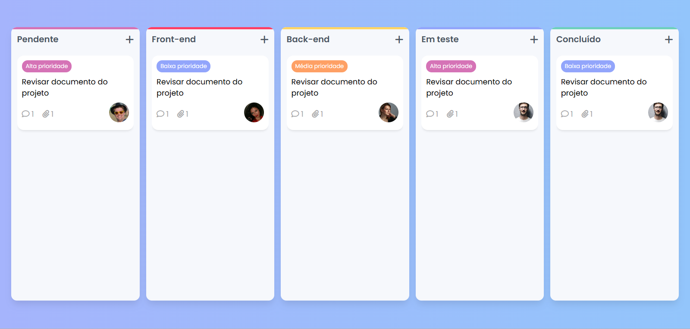
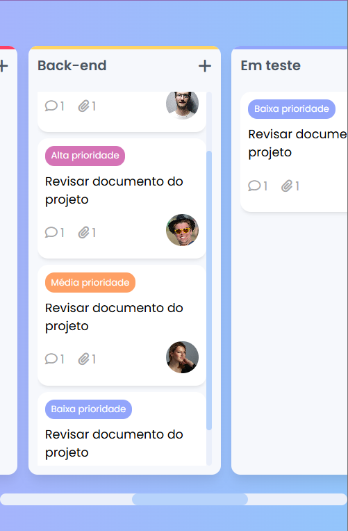

<div align="center">
  <h1>Kanban</h1>
</div>

  

**Kanban** é um projeto simples e responsivo que simula um quadro de tarefas no estilo Kanban. O objetivo principal deste projeto é praticar JavaScript, criando um sistema interativo onde é possível arrastar e soltar tarefas entre diferentes colunas. 

## 📌 Funcionalidades

- Arrastar e soltar tarefas entre quadros.
- Interface responsiva para dispositivos móveis e desktop.
- Design limpo e organizado para fácil visualização das tarefas.

### 🛠 Funcionalidades futuras

- Alteração de etiquetas das tarefas.
- Cadastro de novas tarefas.
- Exclusão e edição de tarefas.
- Salvamento do estado das tarefas no local storage.

---

## 🚀 Demonstração Responsividade

### **Mobile (Dispositivos Móveis)**


---

## 🖥 Tecnologias Utilizadas

- **JavaScript**: Interatividade (drag and drop).
- **CSS3**: Estilização da interface, incluindo responsividade.
- **HTML5**: Estrutura do projeto.

---

## ⚙️ Como Executar o Projeto

1. Clone o repositório:
   ```bash
   git clone https://github.com/seu-usuario/kanban.git
   ```

2. Acesse o diretório do projeto:
   ```bash
   cd kanban
   ```

3. Abra o arquivo `index.html` no navegador:
   ```bash
   start index.html
   ```

---

## 📬 Contato

Em caso de dúvidas ou sugestões, entre em contato:

- **Email**: devgabrielsilveira@gmail.com
- **LinkedIn**: https://www.linkedin.com/in/gabriel-silveira-67979b18a/

Desenvolvido por Gabriel Silveira 🚀
